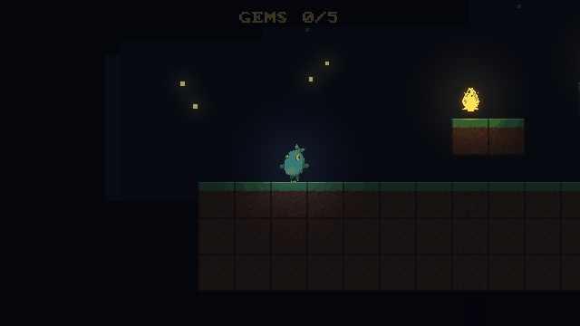

# Vitric

[](https://github.com/BlackBearCC/vitric/actions/workflows/ci.yml)
[](https://github.com/BlackBearCC/vitric/releases)
[](LICENSE)

[English](README.md) | 中文

**一个确定性的、为 AI agent 而造的玻璃盒 2D 游戏引擎。**



*↑ AI 生成的像素美术、2D 动态光照、粒子、相机跟随——每一帧都是 AI 通过控制面无头驱动游戏截下来的。*

现有引擎是为坐在编辑器前的人设计的，对 AI 来说是黑盒。Vitric 围绕一套 **agent API** 来造：引擎里每一份状态都看得见、操作得了、验证得了，AI 可以自己**跑游戏 → 看像素和状态 → 断言 → 改 → 再来一遍**，全程不需要人。又因为模拟是逐位确定的，引擎还能**证明**关于一个游戏的事——比如某段录像确实能通关、一群 agent 怎么玩都卡不死它。

## 目录

- [快速开始](#快速开始) · [agent API](#agent-api) · [自动试玩](#自动试玩)
- [特性](#特性) · [架构](#架构) · [示例](#示例) · [文档](#文档)
- [MCP 与多 agent](#mcp-与多-agent) · [状态](#状态) · [路线图](#路线图) · [参与贡献](#参与贡献) · [许可证](#许可证)

## 快速开始

```bash
cargo build --release
BIN=./target/release/vitric

# 校验项目——报错带路径、稳定错误码、修复提示，一次全给
$BIN check examples/coin-run

# 跑起来（无头 + AI 控制面，端口 6173）
$BIN run examples/coin-run --port 6173

# 自动试玩：一群确定性 agent 把游戏玩一遍，报告哪儿坏了
$BIN playtest examples/coin-run --sessions 16 --html report.html

# 交付门：把一段通关录像逐位重放、并要求触发胜利事件
$BIN gate examples/spire
```

Linux 和 Windows 的预编译二进制在 [releases 页](https://github.com/BlackBearCC/vitric/releases)。

## agent API

引擎无头运行，暴露一套 HTTP JSON-RPC 控制面。agent 像玩家一样玩游戏，只不过走的是数据：

```bash
rpc() { curl -s -X POST http://127.0.0.1:6173/rpc -d "$1"; echo; }
rpc '{"method":"sim/pause"}'
rpc '{"method":"input/inject","params":{"action":"right"}}'
rpc '{"method":"sim/step","params":{"ticks":60}}'                  # 确定性的逐帧步进
rpc '{"method":"world/get","params":{"entity":"@player"}}'         # 读任意实体的状态
rpc '{"method":"render/describe"}'                                 # 语义视图：屏幕上有啥、在哪、谁压着谁
rpc '{"method":"render/screenshot","params":{"path":"shot.png"}}'  # 无头截图，不要 GPU
rpc '{"method":"events/recent"}'                                   # 因果链：碰撞 → 吃到金币 → 通关
```

`render/describe` 是给模型读的：除了实体清单，它还给出相对相机焦点的自我中心空间关系（方位 / 距离 / 视线有没有被挡）、一张关卡 ASCII 图、声明出来的可按动作，以及跟上一次相比变了啥的帧间差量。

完整方法参考：[docs/agent-guide.md](docs/agent-guide.md)（[English](docs/agent-guide.en.md)）。

## 自动试玩

`vitric playtest` 放一群确定性 agent 把游戏玩一遍，聚合出一份结构化报告——就是那种人肉做又慢又测不全的机械 QA。它清的是**地板**（机械正确性和数值平衡），不是**天花板**（好不好玩、手感、美术——那些还得人来判）。

swarm 会报告：

- **通关率与可达性**——到底通不通得了？哪些声明的结局没有任何一局走到？
- **软锁**（卡死无解）——哪些操作顺序会把一局带进再也赢不了的死局，按触发条件聚类、可重放。
- **废内容**——从没被任何一局用到的道具、技能、动作。
- **节奏**——玩家普遍卡在哪、难度在哪突然劝退。
- **数值崩**——经济跑飞（某个数无界地涨）/ 崩盘（归零卡死）/ 溢出。
- **一招鲜**——某个动作或 build 碾压其他所有选择，让别的选项变得没意义。
- **清晰度 / 连续性**——可选的 LLM 试玩员会提"我看不懂该干嘛"或"这段对话和前面一幕矛盾"。

引擎有两点让这件事能成、也和别的引擎拉开差距：

- **前瞻搜索。** 因为模拟是确定的、能精确存档/读档，agent 可以**试着**走一个动作、向前推几帧、给结果打分、再回退——真的在玩技巧类游戏，而不是瞎按。（`--strategy lookahead`。）
- **证书当种子。** 一段 `vitric gate` 的通关录像既是"这游戏能通"的证明，又是 swarm 的种子：它在已知解法上做扰动（换顺序、走岔路、跳一步）找破绽——这是测解谜和剧情类游戏可行的办法。

试玩门槛——零软锁、最低通关率、无不可达结局——可以声明成一道交付门（`vitric.json` 里的 `gates.playtest`），让"swarm 没能玩坏它"成为交付契约的一部分。报告能渲染成一页自包含的 HTML。详见 [docs/design-agent-playtest.md](docs/design-agent-playtest.md)。

## 特性

**确定性与验证**
- 固定步长、播种的 PCG32 随机数（Rust 和 JS 共用一条流）、输入录制。
- `vitric replay` 重跑一段录像、逐位校验检查点哈希——任何 bug 都能重放到它出问题的那一帧。
- `vitric gate` 把通关录像变成一张伪造不了的交付证书：逐位重放 + 必须触发的终止事件 + 每个 tick 都求值的断言。"做完了"由机器裁决，不是 agent 自己说的。

**一切皆数据**
- 场景、实体、规则、世界的每一帧都是有强 schema 的 JSON——写入即校验、运行时可查、能往返。存档就是完整快照；没有藏在编辑器二进制里的状态。
- 存档/读档是精确的——存档读档、重放、前瞻搜索都从这一个原语长出来。

**编写玩法**
- **规则优先。** 约 80% 的玩法是声明式的 `当 X 则 Y` 规则（故意不做图灵完备；级联死循环直接报错）。
- **脚本带安全带。** 其余写成 JS/TS 系统，但必须声明自己读写哪些组件——没声明就写会被拒，所以引擎永远知道每个系统的影响范围。TypeScript 经 esbuild 编译，支持热重载。
- **动画单一归属。** 声明式片段 + `Anim` 组件；引擎独占 `Sprite.image` 的写权，所以"我的动画被别的系统打断了"这类 bug 不可能发生。

**渲染**（CPU 光栅化是确定性真相源，wgpu 的 GPU 路径与它对齐）
- 2D 动态光照（环境光 + 点/聚/方向光），零配置的法线浮雕（`hero.png` + `hero_n.png`），2D 投影，泛光后效。
- 屏上文字走语义描述（不靠 OCR）；内置点阵字体，或挂一个 TTF 出带比例字距、抗锯齿的矢量字（含中日韩）。
- 无头截图逐字节确定、可拿来断言——不要 GPU、不要窗口、不要显示会话。
- 帧动画流水线（`vitric assets --frames`）：去重、裁边、打图集、统一色板、BC7 纹理压缩——支持 BC 的 GPU 上，图集纹理的运行时显存约降 4 倍（在 RTX 4090 上验证过）。

**AI 生成的美术**
- `vitric assets` 把项目里的 PNG 统一到一套色板（确定性 median-cut），并程序化或图生图地生成法线贴图。

**给 LLM 看的报错**
- 每条报错都带精确路径、稳定错误码、修复提示——一次全报，不是一条一条挤牙膏。

## 架构

```
crates/
  vitric-ecs       确定性、可自省的 ECS（组件=JSON，有序遍历，快照/哈希）
  vitric-data      声明式数据层（schema 校验、场景实例化、项目加载）
  vitric-rules     当-X-则-Y 规则引擎（触发器/条件/动作/级联保护）
  vitric-script    QuickJS 脚本（强制声明读写、确定性随机、热重载、TS 经 esbuild）
  vitric-sim       固定步长模拟（PCG32、录制/重放、存档/读档、运动 + 碰撞）
  vitric-render    CPU 光栅化 + wgpu GPU 镜像（世界→PNG 无头、光照/投影/泛光、语义描述）
  vitric-control   AI 控制面（HTTP JSON-RPC：查询/修改/注入输入/时间控制/断言/截图）
  vitric-playtest  agent 集群试玩（场景视图、策略含前瞻、种子探索、报告）
  vitric-cli       vitric check / run / replay / gate / playtest / assets / bundle（+ 开窗、检查器、音频）
```

## 示例

`examples/` 下是能直接跑、且都有测试覆盖的样例游戏：`coin-run`（规则 + 脚本 + 动画 + 音频）、`jump`（纯规则零脚本的平台跳跃）、`cave-gen`（按配方生成关卡）、`spire`、`glow`（动态光照）、`ui-menu`/`ui-gallery`、`intro`（时间轴/序列系统）等。

## 文档

- [agent API 参考](docs/agent-guide.md)（[English](docs/agent-guide.en.md)） · [错误码表](docs/errors.md) · [美术流水线](docs/art-pipeline.md)
- 设计稿：[agent 试玩](docs/design-agent-playtest.md)、[UI](docs/design-ui.md)、[帧动画](docs/design-frame-animation.md)、[补间/序列](docs/design-tween-sequence.md)
- 给读仓库的 agent 看的 [llms.txt](llms.txt)。

## MCP 与多 agent

`mcp/` 自带一个官方 MCP server：任何 MCP 客户端（Claude Code / Cursor / Codex …）开箱即可校验、启动、观察、驱动、断言一个 Vitric 游戏。

```json
{ "mcpServers": { "vitric": { "command": "node", "args": ["<repo>/mcp/index.js"], "env": { "VITRIC_BIN": "<repo>/target/release/vitric" } } } }
```

引擎还带了一套多 agent 班子工具：角色工单（`team/`）、协同黑板（`vitric team`）、地盘执法（`vitric turf`），所以 agent 平台可以直接用引擎本身跑一支多 agent 游戏开发班子。详见 [班子手册](docs/team-playbook.md)。

## 状态

1.0 之前，正在积极开发，API 可能变。核心是真实可用且有测试的（CI 里 650+ 个测试，含一个端到端用例：agent 通过 HTTP 通关游戏、录像逐位重放一致）。确定性、重放、交付门、无头渲染、光照/投影/泛光、规则 + TypeScript、存档/读档、场景流转、GPU 呈现、音频、素材统一、帧动画、试玩 swarm、MCP server 都已就位。二进制提供 Linux 和 Windows 版。

## 路线图

**近期**
- [ ] **Web 试玩场（WASM）**——把引擎编译成 WebAssembly，浏览器里直接玩 `coin-run`，不用装 Rust。*为什么：项目零 star 的根因是没人能 30 秒内试到；一键 demo 是杠杆最高的修法。*
- [ ] **基准测试套件**——确定性模拟吞吐 vs. 其他 Rust 2D 引擎（Bevy 2D / Macroquad / Fyrox）。*为什么："确定性"是核心卖点但现在是空口无凭；一张图上的数字才能让选引擎的人信服。*
- [ ] **Cookbook 配方书**——常见玩法模式（背包、对话树、存档点）的规则 + 脚本配方。*为什么：规则 + 脚本的分工是新模式、不熟悉；能复制粘贴的配方是新手跨过学习曲线的方式。*
- [ ] **规则与场景热重载**——改规则和场景数据不用重启模拟（脚本已支持）。*为什么：游戏开发的内循环是 改→跑→改；冷重启拖慢迭代，迭代慢就留不住游戏开发者。*

**长期引擎能力**

*管线*
- [ ] **渲染管线**——后处理链、多 pass、自定义 shader 注入。*为什么：光照/泛光/投影现在是写死的 pass；暴露成可组合管线，才能不改 fork 就做出风格化画面。*
- [ ] **资源管线**——导入 → 压缩 → 打包 → 热更的端到端流水线。*为什么：BC7/帧图集/调色板这些零件现在散落在 CLI 命令里；统一管线是"引擎"和"库"的分水岭。*
- [ ] **构建管线**——一键打包多目标（Windows / macOS / Linux / Web）。*为什么：跨平台出货是 2D 引擎的基线期待；现在只有 Linux/Windows 二进制。*
- [ ] **AI 管线**——agent 试玩 → 报告 → 自动修 bug 的闭环。*为什么：控制面 + swarm + 门禁已就位，但都是手动工具；把闭环跑通（agent 找 bug → agent 改规则/脚本 → 门禁重跑）是这个引擎独有的赌注。*

*加固*
- [ ] **确定性加固**——模糊测试、跨平台逐字节一致性验证、边界覆盖。*为什么：确定性是所有其他能力（重放、联机、门禁）的地基；一次静默违约就让所有通关证书失效。*
- [ ] **性能加固**——模拟/渲染 profiling、热点优化、内存预算。*为什么："确定性"不等于"慢"；没数字，"够快"只是猜测。*
- [ ] **稳定性加固**——崩溃恢复、错误处理、日志/诊断。*为什么：引擎崩了游戏就跟着崩；生产环境要优雅降级，不要 panic。*
- [ ] **安全加固**——脚本沙箱加固、资源校验、防注入。*为什么：脚本来自不可信来源（LLM 生成、用户编写）；沙箱就是引擎的安全周界。*

*新平台*
- [ ] **移动端（iOS / Android）**——编译 + 输入 + 音频 + GPU 全链路。*为什么：2D 游戏的主场是手机；没有移动端，引擎到不了玩家所在的地方。*
- [ ] **确定性多人联机**——基于快照/diff 的网程，跑在确定性模拟之上。*为什么：确定性 + 重放已经给了回滚网程的原料；联机是引擎现有能力上杠杆最高的延伸。*

## 参与贡献

欢迎提 issue 和 PR。`cargo test --workspace` 和 `cargo clippy --workspace --all-targets` 要全过（CI 两个都卡）。新增引擎系统要守确定性规则：所有状态可 JSON 序列化、所有遍历有序、模拟里不碰墙钟时间、不引入未声明的随机。

## 许可证

[MIT](LICENSE) © 2026 BlackBearCC
