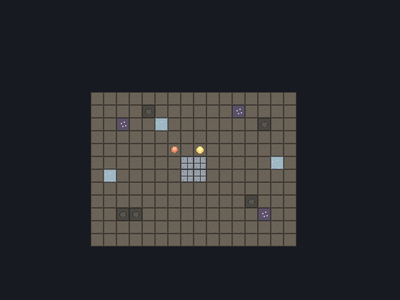
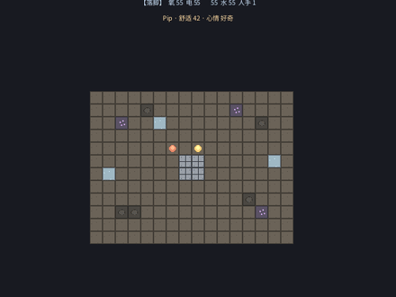

# frontier 《星火》(暂定名) — 白模原型

科幻行星拓荒 × 模拟经营 × 会呼吸的活居民。在一颗荒星的一片区域,从孤身落脚建成有温度的定居点;
来投奔的伙伴由大模型驱动,记得你、有作息、会因为你怎么待这片地和他们而留下或离开。

设计稿:[`docs/superpowers/specs/2026-06-17-frontier-sim-design.md`](../../docs/superpowers/specs/2026-06-17-frontier-sim-design.md)



*↑ 白模一览:屏顶 HUD 显殖民地资源(氧/电/食/人手)和伙伴状态(舒适/心情);点格子建造,种 plot 产氧食、conduit 产电、quarters 是伙伴住所;活伙伴 Pip 自己溜达,按 t 用中文搭话。像素是占位素材,后期走"截图→图生图"美化。*



*↑ 全貌:建好家、铺开产出,殖民地从【落脚】长到【兴旺】(HUD 左上),氧/电/食/水拉满;不同来历的旅人(现生成人设)陆续投奔到 4 人,Pip 用中文搭话。其间还会撞上太阳耀斑把电氧砸下去(屏上警告)。*

## 现在能跑什么(白模)

俯视角像素白模,核心三支柱 + 心脏 C 都跑通了(均已无头自测):

- **地基**:16×12 荒星地表区域、像素瓦片库、玩家四向移动、跟随相机。
- **建设(主玩法)**:数字键 `1`–`6` 选结构(floor/wall/plot/conduit/quarters/extractor),左键在格子上建、右键拆。
- **生存(压力)**:殖民地氧/电/食/水随时间消耗,产出结构续命(plot→氧+食、conduit→电、extractor→水)。**人越多、消耗越大**——每个居民都有胃口(也帮点活,但帮不抵吃),所以招人就得同步扩产能撑住,这是心脏 C 的经济一面:伙伴是你建设的目标,养住他们就是挑战。哪种产出没跟上、那项就一路往下掉(夹 0 不死、可恢复),逼你补对应结构。每隔一阵来一次**太阳耀斑**把电和氧砸下去(屏上警告);产能留了缓冲就扛得过、几秒回血,产能贴边就被咬出一个坑。暖式求生。
- **活伙伴(魂)**:Pip 自己在家附近溜达;按 `t` 搭话 → 拼人设提示词调大模型 → 回复让它变心情、冒中文话泡;回复走录制通道,对话可逐位回放。
- **心脏 C(建设 ↔ 伙伴互喂)**:伙伴在场会帮着撑殖民地(产出加成);伙伴有舒适需求,没住所(quarters)就掉,跌破阈值会主动开口提愿望(预警),长期不管就**离开**——建个住所能把人挽回。
- **伙伴到来(活世界)**:每隔一阵、没满员时,向大模型**现生成**一个不同来历的旅人来投奔(角落落脚、自己溜达、计入帮工),到上限就停。白模阶段到来的是无名背景帮手(不抢对话/不闹需求),原版 Pip 是全功能活伙伴。
- **进展(曲线雏形)**:殖民地随"结构数 + 在场伙伴数"成长,**落脚 → 立足 → 成形 → 兴旺**,阶段显在 HUD 上,给一个发展进展感。
- **HUD**:屏顶常驻显示阶段 + 资源(氧/电/食/水/人手)和伙伴状态(舒适/心情/"走了"),中文。
- **确定性**:整段经营 + LLM 对话能 `vitric replay` 逐位回放(回复从录像取,不再调模型)。已实测 verified。

## 怎么跑

```bash
BIN=./target/release/vitric           # 改了 prelude/引擎要先 cargo build --release -p vitric-cli
python3 games/frontier/tools/gen_font.py   # 生成中文字体(11MB,不入库;不跑则中文不显)
$BIN check games/frontier             # 校验
$BIN run games/frontier --port 6173   # 无头 + 控制面(配合截图/注入做自测)
```

**操作**:方向键移动 · `1`–`6` 选结构(floor/wall/plot/conduit/quarters/extractor)· 左键建 · 右键拆 · `t` 跟伙伴说话。

**让伙伴真开口**:需要配大模型端点 `VITRIC_LLM_URL/KEY/MODEL`。没有真模型时,用自带假端点测链路:

```bash
python3 games/frontier/tools/fake_llm.py 6190 &
VITRIC_LLM_URL=http://127.0.0.1:6190/v1/chat/completions VITRIC_LLM_KEY=x VITRIC_LLM_MODEL=stub \
  $BIN run games/frontier --port 6173
```

## 架构(落在 Vitric 上)

- 地表/结构/玩家/伙伴都是实体 + 组件(JSON,可快照/回放)。
- 建造、移动、生存速率结算走规则(when-X-then-Y)+ 脚本系统;跨实体聚合用"统计系统发事件→规则落字段→消耗系统每帧结算"。
- 伙伴的脑走 `ctx.ask`(引擎统一的对外问话 + 录制),回复经内置 `__onReply` 分发到脚本回调。
- 全程确定性:这趟经营、这段对话都能逐位存档/回放。

## 工具(`tools/`)

- `gen_tiles.py` — 生成像素白模瓦片库(确定性,固定种子)。
- `gen_scene.py` — 生成 `scenes/main.json`(地表 + 登陆舱 + 玩家 + 伙伴 + 殖民地 + HUD)。
- `gen_font.py` — 从系统 Noto CJK 抽一份单体中文字体到 `fonts/cjk.otf`(不入库)。
- `fake_llm.py` — 开发用假大模型端点,测伙伴对话链路。

## 已知白模欠账

- 美术是占位像素;最终走"关卡截图 → 图生图"美化,不在白模期锁死。
- 话泡/HUD 长文字会横向溢出——引擎 Text 不换行,后续 UI 关做换行/话泡框。
- 到来的伙伴目前是**无名背景帮手**(会溜达/帮工,不单独对话、不闹需求);原版 Pip 才是全功能活伙伴。这是设计简化,不是引擎缺陷——真正的拦路坑只有一个:**多伙伴对话路由**。现在 LLM 回复经 `companion-said` 硬连 `@companion`,只有 Pip 能各聊各的;要让到来的伙伴也单独对话/许愿,得让回复按实体句柄落到对应伙伴身上(规则按静态 `@名字` 引用,做不了运行时句柄寻址,得在 fn 里直接按句柄写组件)。
  - 更正一处旧误记:`ctx.despawn(e.id)` 从脚本系统删**命名**实体是干净的,名字和实体一起清掉——有测试 `system_despawn_of_named_entity_fully_removes_it` 锁住。早先把"人手不归零"当成 despawn 引擎 bug,真因是按 `[Companion]` 查的统计系统在 0 实体时根本不跑、计数滞留,已用总在跑的 census 系统(挂 `@colony`)修掉。
- 还没做:科技树/贸易/更多资源、五幕曲线、关卡截图 → 图生图美化。
